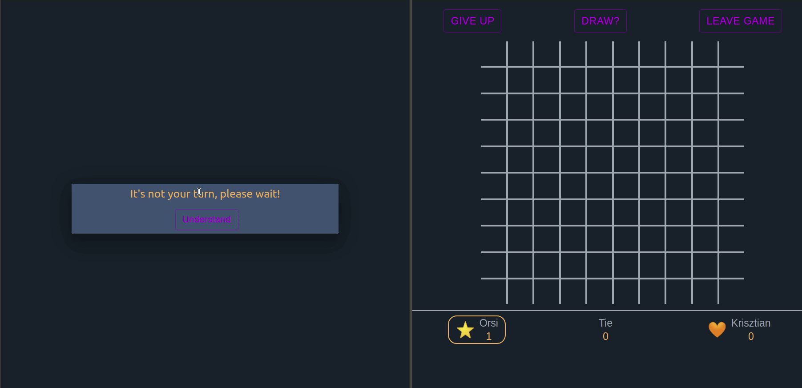
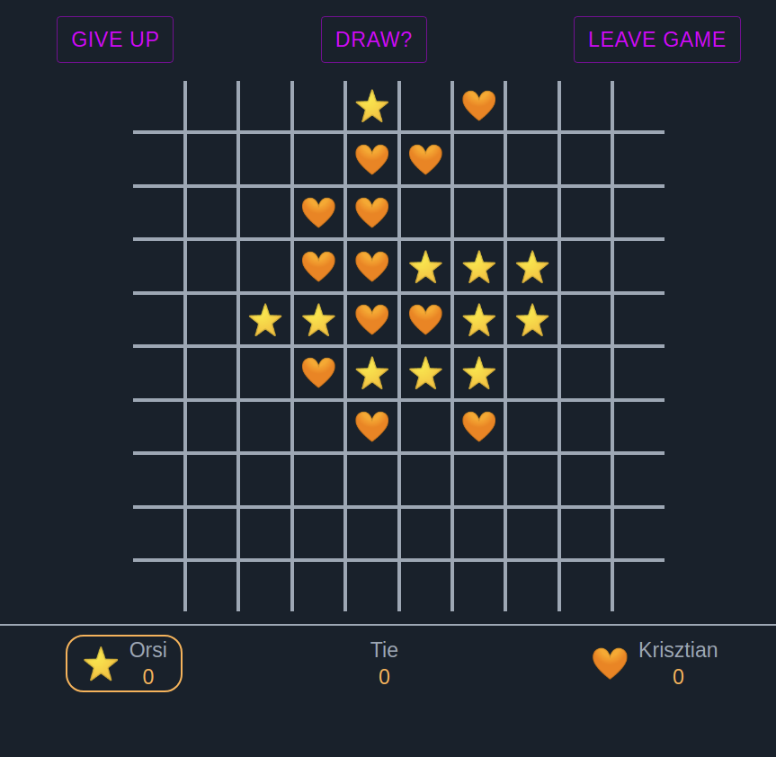
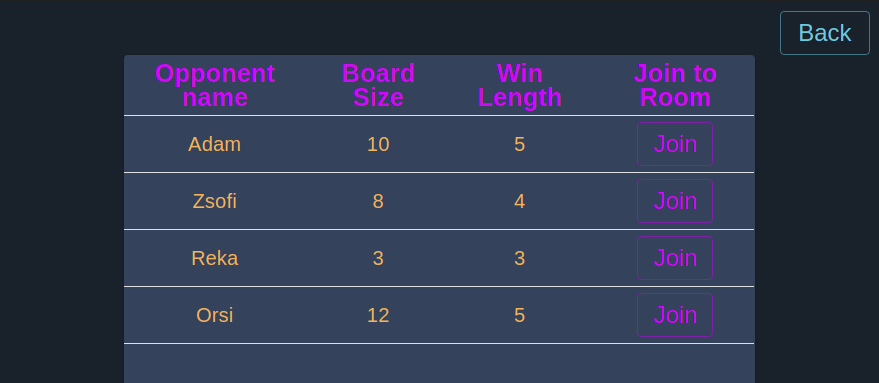
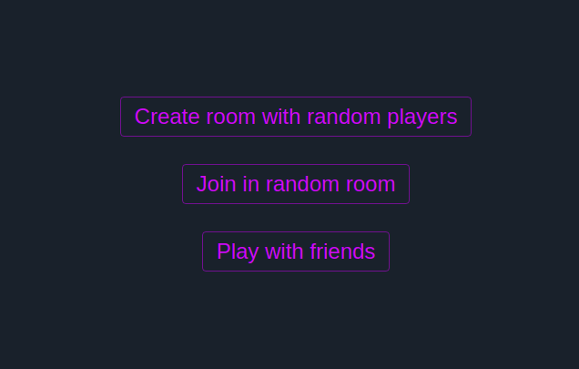
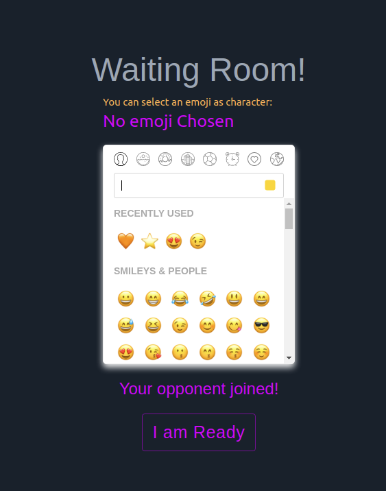

# Online multiplayer Tic-tac-toe game with emoji characters

The game is deployed in this website: https://amobagame.herokuapp.com/

Used main technologies: 
 

Demo video (I put 2 browser next to each other):

This is not just a 3 X 3 Tic-tac-toe game. Here the players can select the size of the table and also can define how many characters needs to be in one line for the victory (between 3 and 5).
 
A huge amount of emojies can be selected before game starts.

There are 2 ways of starting a new game:
* Create new game with a friend. In this case the player who create the room, can send a link to someone. If someone click on the sent link, the game will connect the players with each others and the game will start
* Create game with random enemy. In this case the first player can create a room and then wait for other players to join. There is an option in the game to find available rooms. When someone joins the game will start automatically

After the 2 players connected with each others, thw 2 players get into the waiting room where both players can select an emoji character to play with. If the player does not select anything, 'X' or 'O' characters will be used in the game.

Users can give up the game or offer a draw. In both cases the opponent will be notified in dialog boxes. Also if one player leaves the game, the other player automatically win the game and will be notified that the opponent left the game.
After the game finished both players can start a rematch or leave the game.
If the players would make a move against the rules a dialog will pop up and tells what is the problem.

At the moment the game looks good only in desktop view.

Random picture from a game:
 

Join to a random game:
 

Menu
 

Waiting room - emoji selectors

 

